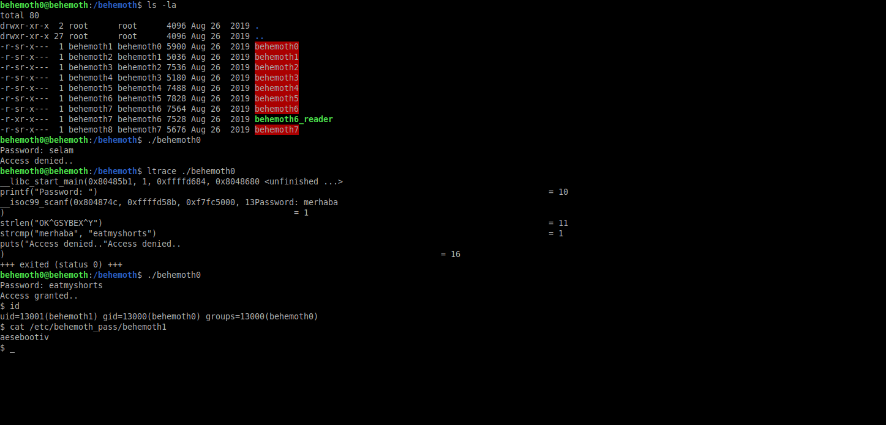

# Behemoth: Level 0 Writeup

    ssh behemoth0@behemoth.labs.overthewire.org -p 2221
    password: behemoth0

ltrace aracılığı ile programımızı çalıştırıp çıktıyı incelediğimiz zaman bizden istediği parolanın `eatmyshorts` olduğunu görüyoruz. Bu parolayı programımızı çalıştırıp yazdığımız zaman shellimiz gelecektir. Geriye kalan sadece `behemoth1` kullanıcısının parolasının olduğu dosyayı okumak.

`behemoth1:aesebootiv`
