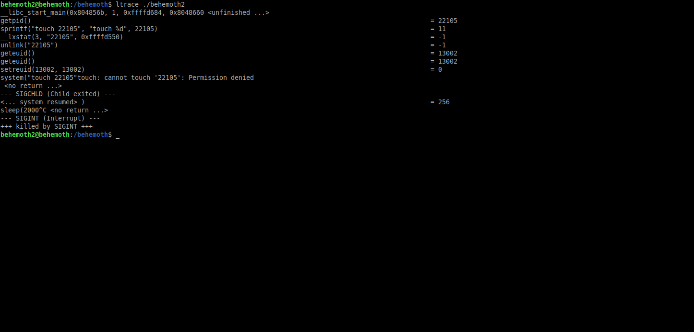
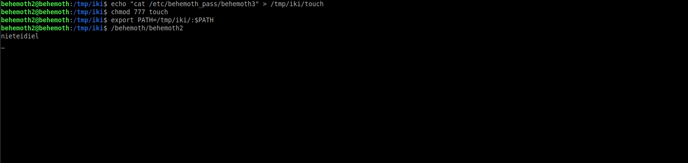
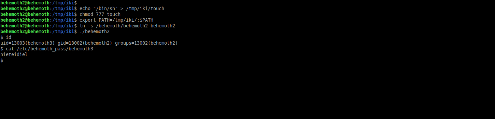

# Behemoth: Level 2 Writeup

    ssh behemoth2@behemoth.labs.overthewire.org -p 2221
    password: eimahquuof

ltrace ile programımızı incelediğimiz zaman `system` fonksiyonu ile touch komutu çalıştırıyor. Eğer biz kendimiz `touch` isimli bir dosya oluşturup içerisine çalıştırmak istediğimiz komutu yazarsak ve bunu `PATH`'e eklersek, programımızı çalıştırdığımızda oluşturmuş olduğumuz dosya devreye girecek ve içindeki komut çalışacaktır.  

Burda dikkat etmemiz gereken şey oluşturduğumuz `touch` isimli dosyanın çalıştırılabilir olması ve `PATH`'e eklenmesi.

Onun dışında iki farklı senaryo izleyebilirsiniz. İsterseniz direk `cat /etc/behemoth_pass/behemoth3` komutunu çalıştırıp parolayı okuyabilir veya `/bin/sh` komutunu çalıştırıp tekrardan elle parolayı okuyabilirsiniz

`behemoth3:nieteidiel`
