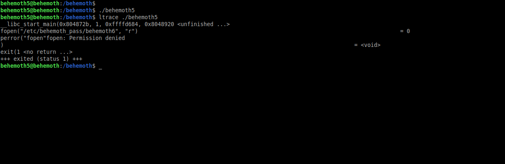
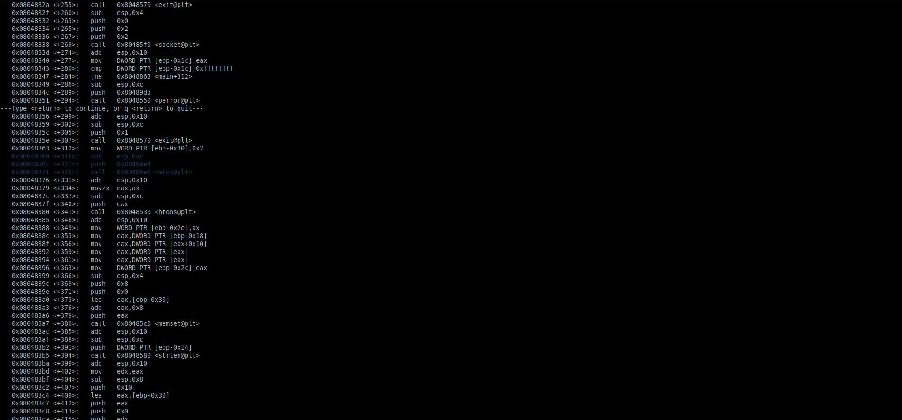
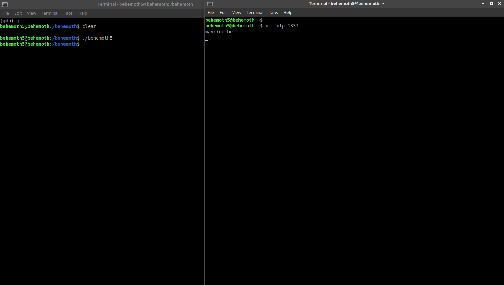

# Behemoth: Level 5 Writeup

    ssh behemoth5@behemoth.labs.overthewire.org -p 2221
    password: aizeeshing



Aslında programımız istediğimiz dosyayı okumaya çalışıyor ancak bir nedenden ötürü hata alıyor. Bunun sebebini anlamak için gdb ile açıp detaylıca inceleyelim



Burda dikkatimizi çekmesi gereken 2 tane husus var. Öncelikle dikkat ederseniz `push 0x0, push 0x2, push 0x2, call socket@plt` işlemi görülmekte. Peki bu socketi nereye açıyor kime açıyor nasıl açıyor... ? Tabi bununda bir püf noktası var. `socket` işlemini çağırmadan önce stack'e gönderdiği şeylerin bir anlamı var

    0x0 => IPPROTO_IP
    0x2 => UDP
    0x2 => IPv4

Pekala UDP üzerinden bir socket açıp veri gönderdiğini düşünüyoruz artık ama hangi port ? Onu da `atoi@plt` çağrısı yapılmadan önce stack içerisine pushlanan değerden öğrenebiliriz.

```bash
(gdb) x/s 0x80489e4
0x80489e4:	"1337"
(gdb)
```




`behemoth6:mayiroeche`
