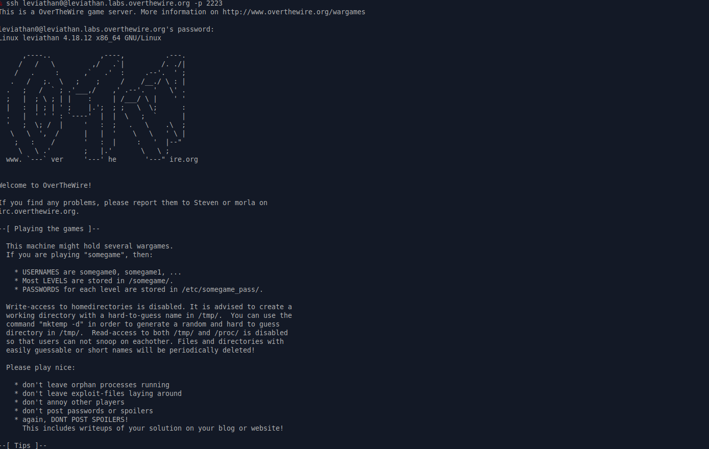
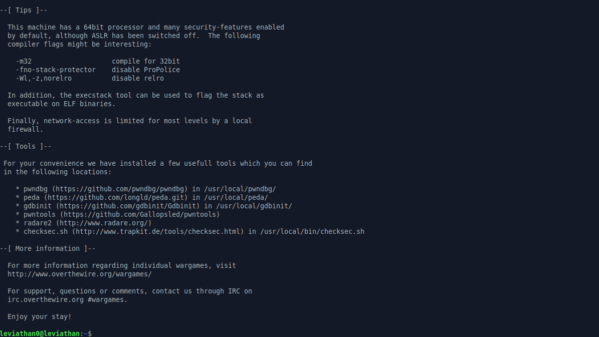
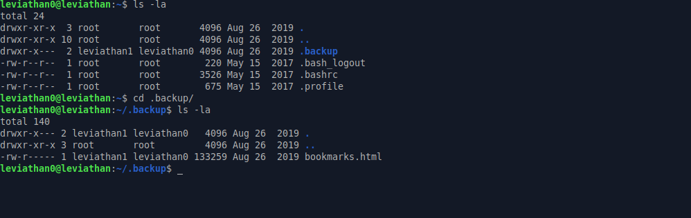
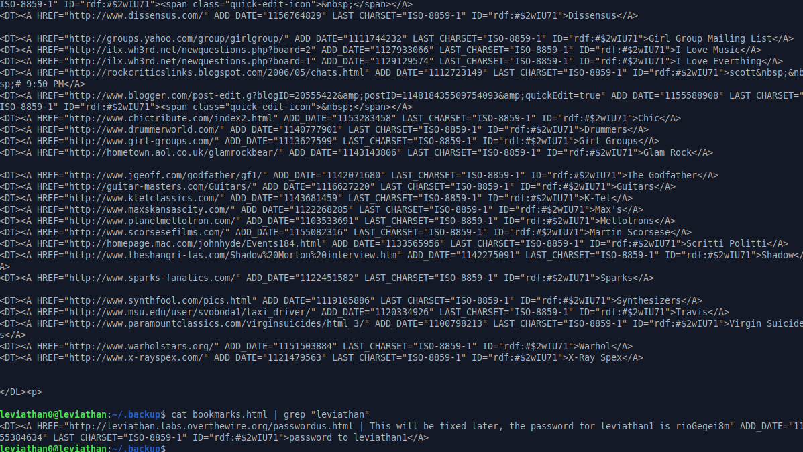

# Leviathan: Level 0 Writeup

    ssh leviathan0@leviathan.labs.overthewire.org -p 2223
    password: leviathan0

Makinemize giriş yaptık. Hemen bulunduğumuz dizinde neler varmış bir bakalım

`.backup` isimli bir klasör dikkatimizi çekiyor ve içerisine baktığımız zaman `bookmarks.html` isimli bir dosya olduğunu görüyoruz.

Bunun içerisinde ne varmış bir bakalım...

Uzun bir çıktı olduğu için incelemesi zor olacaktı. Bu yüzden `leviathan1` kullanıcısı ile herhangi bir bilgi var mı diye `grep` aracından yardım alıyoruz. Ve `leviathan1` kullanıcısına ait parolayı elde ediyoruz.

`leviathan1:rioGegei8m`
