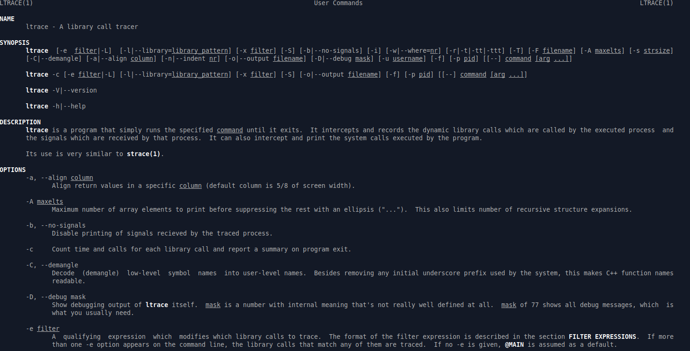

# Leviathan: Level 1 Writeup

    ssh leviathan1@leviathan.labs.overthewire.org -p 2223
    password: rioGegei8m

İlk yazıda leviathan1 kullanıcısının parolasını elde etmiştik. Şimdi bu kullanıcı ile sisteme girerek `leviathan2` kullanıcısına ait parola bilgisini bulmaya çalışacağız :joy: ve böyle devam edip gidecek.

`check` isimli bir dosyamız olduğunu görüyoruz. Çalıştıralım bakalım ne işe yarıyormuş

Bizden bir `password` istiyormuş. Burda bizden istediği parolayı öğrenmek için `ltrace` aracından yardım alacağız. Peki `ltrace nedir ?`

Evet kısaca `ltrace` şöyle bişiler. İsterseniz daha detaylı araştırabilirsiniz.

`ltrace ./check` komutunu giriyoruz ve daha sonra rastgele bir parola giriyoruz.

Gördüğünüz üzere aslında 3 karakterlik bir passworde ihtiyacımız varmış. Ve bu parolayıda `strcmp` fonksiyonu ile karşılaştırarak kontrol ediyor. Eee haliyle kontrol ettiği şey bizim parolamız oluyor.

Programımızı normal bir şekilde çalıştırıp bizden istediği parolayı girelim

Ve gördüğünüz üzere leviathan2 kullanıcısına geçiş yapmış olduk. Kullanıcılara ait parola bilgileri `/etc/leviathan_pass/` dizini altında tutulmakta. İlgili dizinde ilgili dosyamızı okuduğumuz zaman `leviathan2` kullanıcısının da parolasını öğrenmiş oluyoruz.

`leviathan2:ougahZi8Ta`
