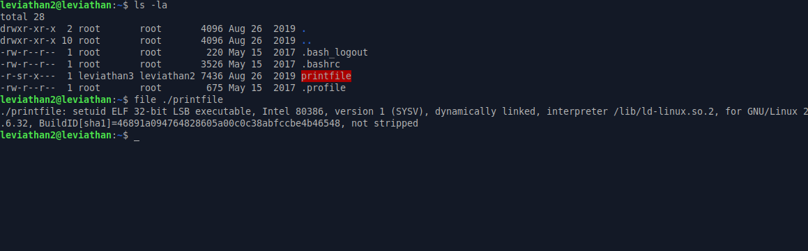
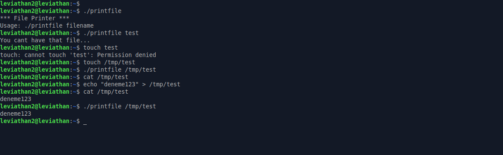
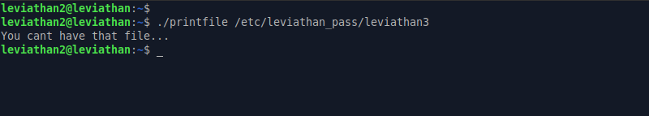
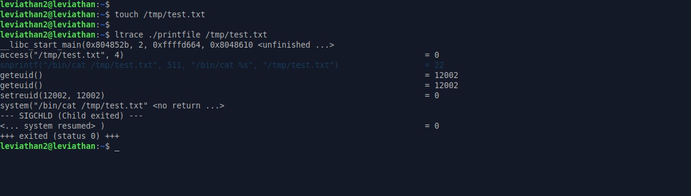
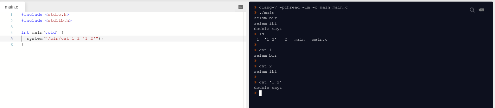
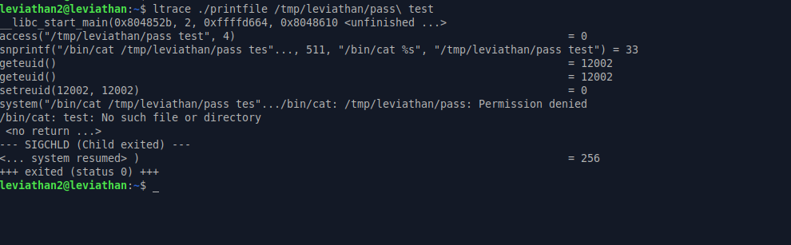

# Leviathan: Level 2 Writeup

    ssh leviathan2@leviathan.labs.overthewire.org -p 2223
    password: ougahZi8Ta



Elimizde gene 32 bit çalıştırılabilir bir linux dosyası mevcut. Hızlıca bakalım ne işe yarıyormuş



Bizden argüman olarak bir dosya istiyor ve daha sonra o dosyanın içerisinde yazan şeyi ekrana basıyor. Eee durum böyle olunca tabi aklımıza ilk olarak `leviathan3` kullanıcısının parolasının olduğu dosyayı okutmak geliyor.



Ancak o kadar da basit değil :joy: Gerçi buraya kadar gelmişiz biraz zor olsun tabi

`ltrace` ile bi göz gezdirelim arkada ne olaylar dönüyormuş



İlk önce okumak istediğimiz dosyanın ne olduğuna bakıyor. Daha sonra bu dosyada yetkimiz var mı yok mu bunu kontrol ediyor. Eğer yetkimiz yok ise içeriğini bize göstermiyor 🤔

`NOT` : Burda yetkimizin olup olmadığını ilk başta bulunan `access` fonksiyonu ile tespit ediyor. Dosya leviathan3'e ait iken biz leviathan2 kullanıcısı olarak bakmaya çalıştığımızda da haliyle bize göstermiyor

Pekala o zaman biz bunu nasıl okuyacaz ? Yok mudur bunun bir yolu yordamı ? Eh soru olarak böyle bişi koydularsa vardır bişiler heralde 😁

Bunu isterseniz uygulamalı olarak gösterelim

```C
#include <stdio.h>
#include <stdlib.h>

int main(void) {
  system("/bin/cat 1 2 '1 2'");
}
```



Şimdi `/bin/cat` işlemine 3 tane argüman verdik ve 3 argümanıda ekrana bastı. Burda dikkatimizi çeken birşey var. '1 2' olarak yazdığımız zaman bizim `'1 2'` isimli dosyamızın içeriğini ekrana basıyor öyle değil mi ? Ancak tırnak ifadeleri olmadan direk `1 2` yazarsam önce `1` isimli dosyanın sonra `2` numaralı dosyayın içeriğini ekrana basıyor.

Yukarda bakmış olduğumuz `ltrace` çıktısına bakacak olursak eğer girmiş olduğumuz dizini `' ' (tek tırnaklar)` arasına almadan direk argüman olarak kullanıyor. Yani ben `/etc/leviathan_pass/leviathan3` dosyasını `ln` komutu yardımıyla bir dosya üzerine linklendirme/bağlantı kurma işlemi gerçekleştirsem ve daha sonra sembolik bağlantı dosyasının adında bir dosya daha oluşturup arasında boşluk bırakarak yanına rastgele bir kelime daha eklesem nasıl olur ?

Örnek verecek olacak olursak eğer;

    ln -s /etc/leviathan_pass/leviathan3 leviathan3password
    touch leviathan3password\ falanfilan

Artık iki tane dosyam var. Biri direk `leviathan3password->/etc/leviathan_pass/leviathan3` diğeri ise `'leviathan3password falanfilan'`

Ben eğer argüman olarak `leviathan3password falanfilan` dosyasını verirsem bu dosyanın izinlere bana ait olduğu için `access` kontrolünden geçecektir. Daha sonra `system` fonksiyonu içerisinde gelecektir. Dosyanın yolunu tırnak içerisinde almadığı içinde `leviathan3password` ve `falanfilan` isimli iki ayrı dosyayı okuyup ekrana basmaya çalışacaktır.

Sanırım bu kısmı anlatabildim. Eğer kafalarda soru işareti kalmadıysa devam edelim ve bunu uygulayalım


Ve gördüğünüz gibi yaptığımız işlem işe yaradı ve `leviathan3` kullanıcısının parolasını elde ettik.

`leviathan3:Ahdiemoo1j`

`NOT`: Bu şekilde argüman verdiğimiz zaman arkada dönen olayı görmek isteyenler için şunuda şuraya bırakayım


