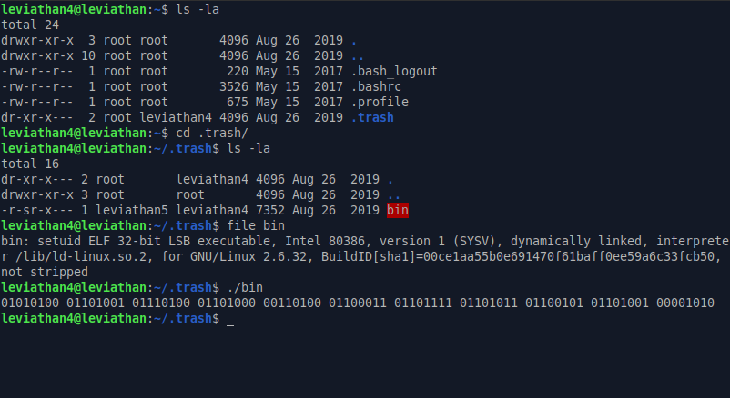
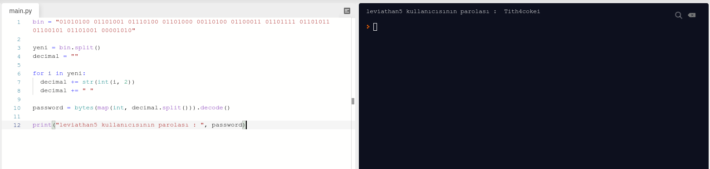

# Leviathan: Level 4 Writeup

    ssh leviathan4@leviathan.labs.overthewire.org -p 2223
    password: vuH0coox6m



Bize binary olarak bir çıktı veriyor. Bu çıktıyı anlamlandırdığımız zaman büyük ihtimalle bize leviathan5 kullanıcısının parolasını verecektir.

Bunun için ufak bir script işimizi çözecektir

```python
bin = "01010100 01101001 01110100 01101000 00110100 01100011 01101111 01101011 01100101 01101001 00001010"

yeni = bin.split()
decimal = ""

for i in yeni:
  decimal += str(int(i, 2))
  decimal += " "

password = bytes(map(int, decimal.split())).decode()

print("leviathan5 kullanıcısının parolası : ", password)
```



`leviathan5:Tith4cokei`
