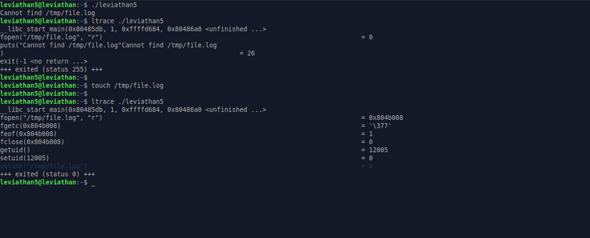

# Leviathan: Level 5 Writeup

    ssh leviathan5@leviathan.labs.overthewire.org -p 2223
    password: Tith4cokei

Çalıştırıp bir bakalım bu sefer bizi ne bekliyormuş :)

Hmm `/tmp` dizininde bulunan `file.log` isimli dosyayı okuyormuş. O halde biz okumak istediğimiz `/etc/leviathan_pass/leviathan6` dosyasını `tmp` dizini altında `file.log` isimli bir dosya ile bağlasak güzel şeyler olur sanırım 😂

`leviathan6:UgaoFee4li`
