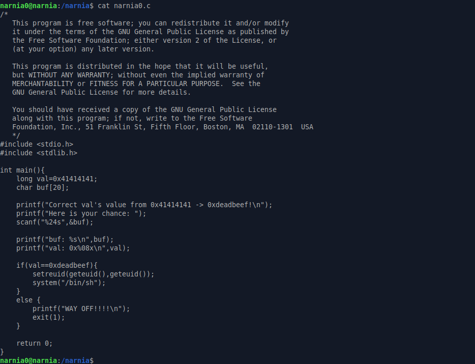

# Narnia: Level 0 Writeup

    ssh narnia0@narnia.labs.overthewire.org -p 2226
    password: narnia0

`Narnia` içerisinde bulunan sorulara erişmek için /narnia dizinine gitmemiz gerekmektedir...

İlgili dizine geldiğimiz zaman tüm soruların `C` kodlarını ve derlenmiş hallerini burda görebiliyoruz.

Madem kodlarını görmemize müsade etmişler o zaman inceleyelim bakalım bizi neler bekliyormuş :)

Hmm klasik stack tabanlı buffer overflow zafiyeti var gibi gözüküyor. Bilmeyen arkadaşlar için olayı kısaca anlatacak olursak eğer local bir değişkenimiz var ve bunun içerisinde `0x41414141` yazmakta. Ayrıca bir adette `20` karakter uzunluğunda bir buffer alanı var. Bizden istediği şey ise bu 20 karakterlik buffer alanını taşırarak `0x41414141` değerini `0xdeadbeef` olarak güncellememiz. Eğer bu şekilde değiştirebilirsek eğer bize `narnia1` kullanıcı olarak bir shell açacağını söylemiş.

Evet temel olarak bu şekilde işte. Hemen deneme amaçlı birşeyler girelim programımıza

Gördüğünüz üzere 20 karakterlik buffer alanını `A` karakterleri ile doldurduktan sonra yazdığımız `B` karakterleri `val` değişkenine yazıldı. O halde `B` karakterlerinin olduğu yere `0xdeadbeef` yazabiliriz. Ama dikkat etmemiz gereken şey bunun little-endian olarak yazılması gerektiği (yani tersten)

`narnia1:efeidiedae`
