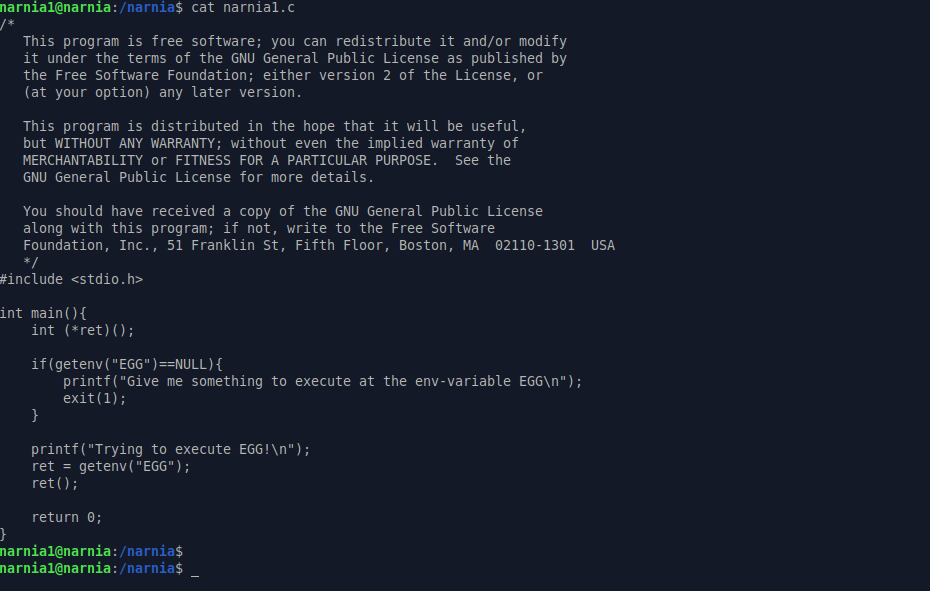
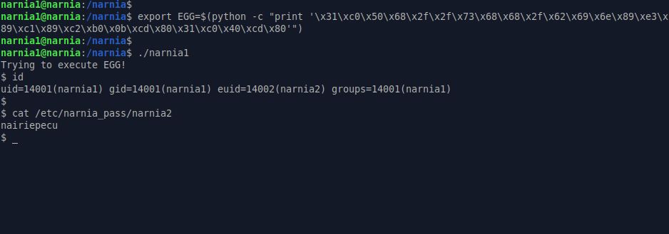

# Narnia: Level 1 Writeup

    ssh narnia1@narnia.labs.overthewire.org -p 2226
    password: efeidiedae

`EGG` isminde bir ortam değişkeni arıyor. Eğer boş ise bu ortam değişkeninin içerisine çalıştırabileceğim birşeyler koy diyor. Eğer içi doluysa da içindekini çalıştırıyor.

Durum böyle olunca aklımıza hemen bir shellcode bulup bunu `EGG` isimli bir ortam değişkenine yüklemek geliyor

`Shellcode` : http://shell-storm.org/shellcode/files/shellcode-811.php

`narnia2:nairiepecu`
