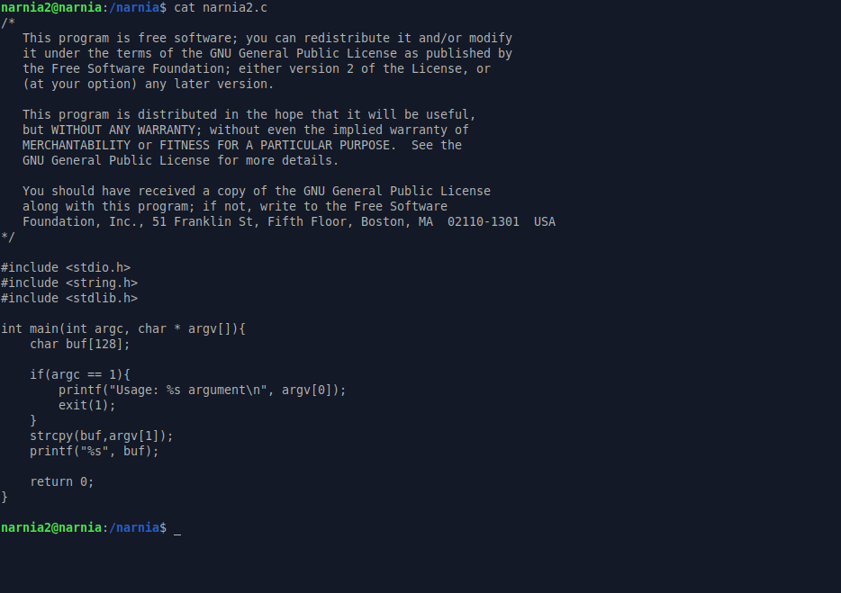
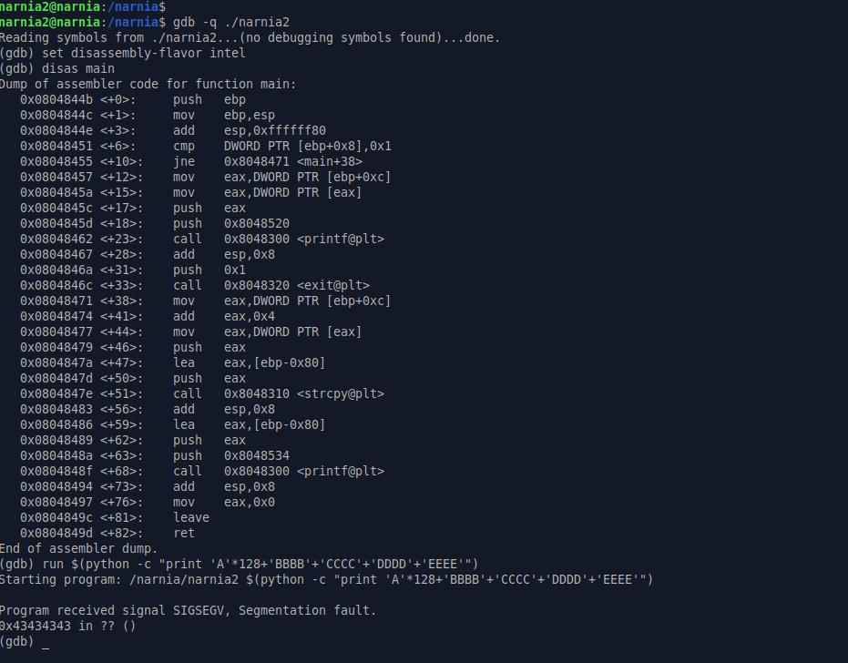
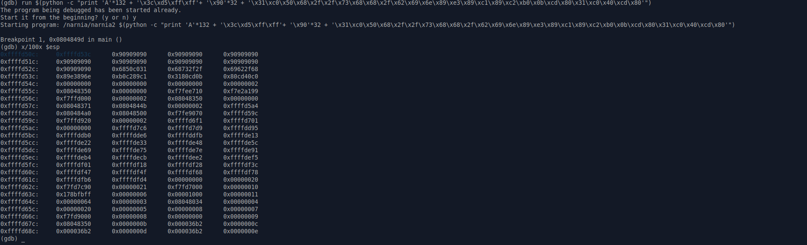
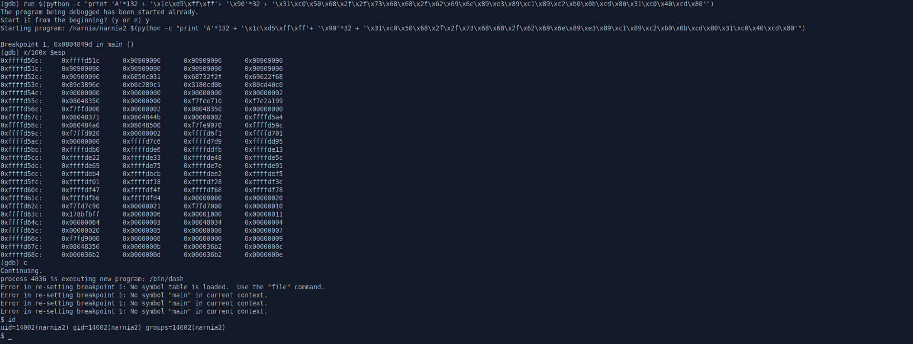
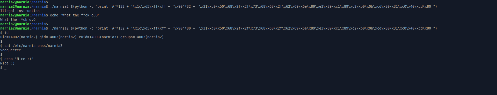

# Narnia: Level 2 Writeup

    ssh narnia2@narnia.labs.overthewire.org -p 2226
    password: nairiepecu

128 byte'lık bir buffer alanımız var. Bu buffer alanını taşırarak `EIP` registerına shellcode'umuzun olduğu adresi yazacağız.

Öncelikle `EIP` registerına müdahale edebilmek için kaç karakter girmemiz gerekiyor onu bulalım.

Offset değerimiz 132 karaktermiş. O halde main fonksiyonumuzda`ret` işleminin olduğu kısma bir breakpoint koyalım ve offset+shellcode gönderelim

`ESP`'nin gösterdiği yerde shellcode'umuzun başlangıcını görüyoruz. Bu şekilde direk çalıştıramayacağımız için shellcode'u biraz ileriye taşıyıp daha sonra shellcode'un başlangıç adresini `ESP`'nin gösterdiği yere yazacaz

Hmm burda birşeyler oldu sanırım. `ESP` registerının adresi değişti. Önceden `0xffffd52c` adresindeyken şuan `0xffffd50c` adresini göstermekte. O halde bizde payloadımızdaki adresi güncelleyelim o zaman

Adresi güncelledik ve stack durumunu kontrol ettik. Herhangi bir sıkıntı görmediğimiz için devam ederek shellcode'umuzu çalıştırmış olduk. Ancak dikkat etmemiz gereken birşey var ki o da şuan `narnia3` kullanıcı yetkilerine sahip değiliz yani password dosyasını okuyamayacağız. Bunun için `gdb` aracından çıkıp direk çalıştırmamız gerekecek.

İlk çalıştırdığımızda ufak bi hata aldık. Muhtemelen stack içerisinde gene bir kayma durumu oldu. Bunun için aradaki `NOP` karakterleri biraz daha arttırdık ve başarılı bir şekilde shellimizi aldık.

`narnia3:vaequeezee`
