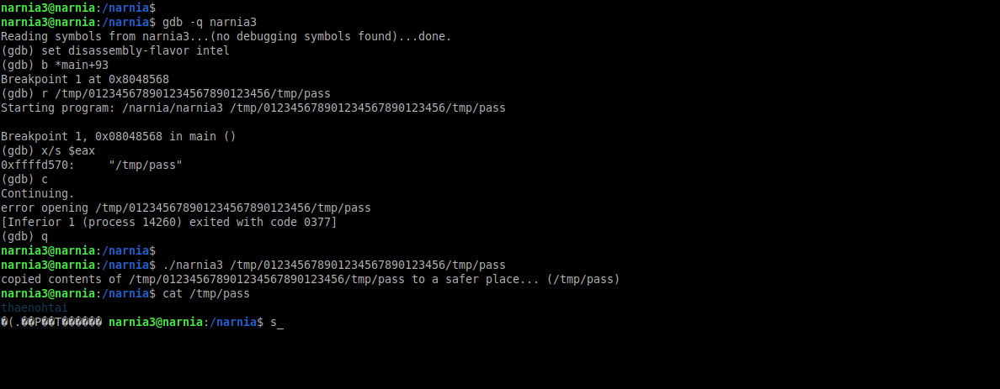

# Narnia: Level 3 Writeup

    ssh narnia3@narnia.labs.overthewire.org -p 2226
    password: vaequeezee

Öncelikle kodumuzu hızlıca bir inceleyip ne yaptığını bir anlayalım. İki tane değişkenimiz var ve içlerinde birşey yok. 3 adet de buffer'ımız mevcut. Birinin içerisine `/dev/null` yazılmış diğerlerinin ise içi boş. Eğer yeterli sayıda argüman girmezsek bize nasıl kullanılacağına dair bir mesaj yazıyor.

Buraya kadar herhangi birşey yok gibi. Burdan sonra ise girmiş olduğumuz argümanı `strcpy` fonksiyonu ile `ifile` buffer alanının içerisine yazıyor (Yani burda bir adet zafiyetimiz mevcut, yazalım bir kenara devam edelim).

Daha sonra bir if bloğu ile karşılaşıyoruz. `open` fonksiyonu ile `ofile` içerisinde yazan dosyada tam yetkimiz olup olmadığına bakıyor. Eğer yoksa bu dosyayı açamadım diyor ve çıkış yapıyor. Yetkimiz var ise devam ediyor ve bu sefer `ifile` içerisinde yazan dosyada okuma iznimiz olup olmadığını kontrol ediyor. İznimiz yoksa programdan çıkış yapıyor.

Tüm bu süreçler geçtikten sonra bizim argüman olarak girmiş olduğumuz dosyayı (ifile) okuyor ve ofile içerisinde yazan dosyanın içerisine yazıyor.

İlk open işlemine bir breakpoint atalım ve rastgele 32 karakterden daha uzun bir dosya dizini girelim

Normalde `/dev/null` tutan buffer alanını bozduk ve istediğimiz bir dizini yazabildik. Artık outputfile (ofile) yani içerisine birşeyler yazacağımız dosyayı değiştirebiliyoruz.

Şimdi ikinci aşamayı test etmek için hızlıca bir dosya oluşturalım ve bakalım nasıl birşey ile karşılaşıcaz

    narnia3@narnia:/narnia$ mkdir /tmp/denemedizini
    narnia3@narnia:/narnia$ touch /tmp/denemedizini/test
    narnia3@narnia:/narnia$ chmod +777 /tmp/denemedizini/test

Hmm girmiş olduğumuz argümandaki dizine giderek ordaki dosyayı okumaya çalışıyor. O halde benim yazmak istediğim dosyada okumak istediğim dosyada `/tmp` dizini altında olması lazım.

Bu şekilde `/tmp/012345678901234567890123456` ile 32 byte uzunluğuna ulaşmış oluyoruz. Bundan sonra yazdığımız `/tmp/pass` bizim `outputfile` değeri olacak. Böylelikle `/tmp/012345678901234567890123456/tmp/pass` dosyası `inputfile` olacak (okunacak olan dosya) ve `/tmp/pass`'de `outputfile` olacak (yazılacak olan dosya).

`inputfile` 'ı da eğer `/etc/narnia_pass/narnia4` ile bağlarsam `narnia4` kullanıcısına ait parolayı okuyup daha sonrada yazdırabilirim.

`narnia4:thaenohtai`
