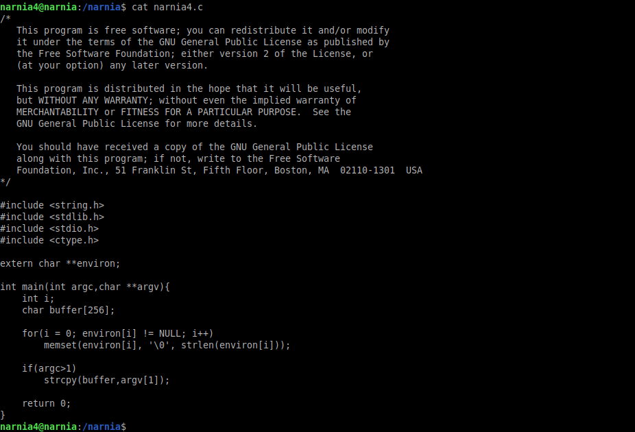
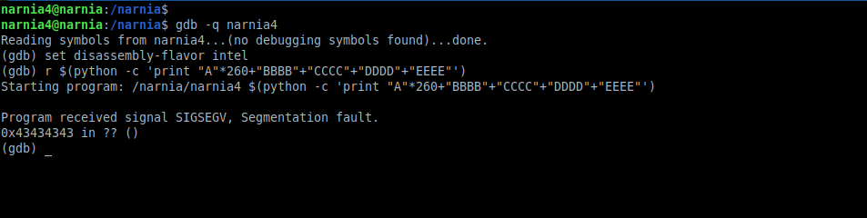
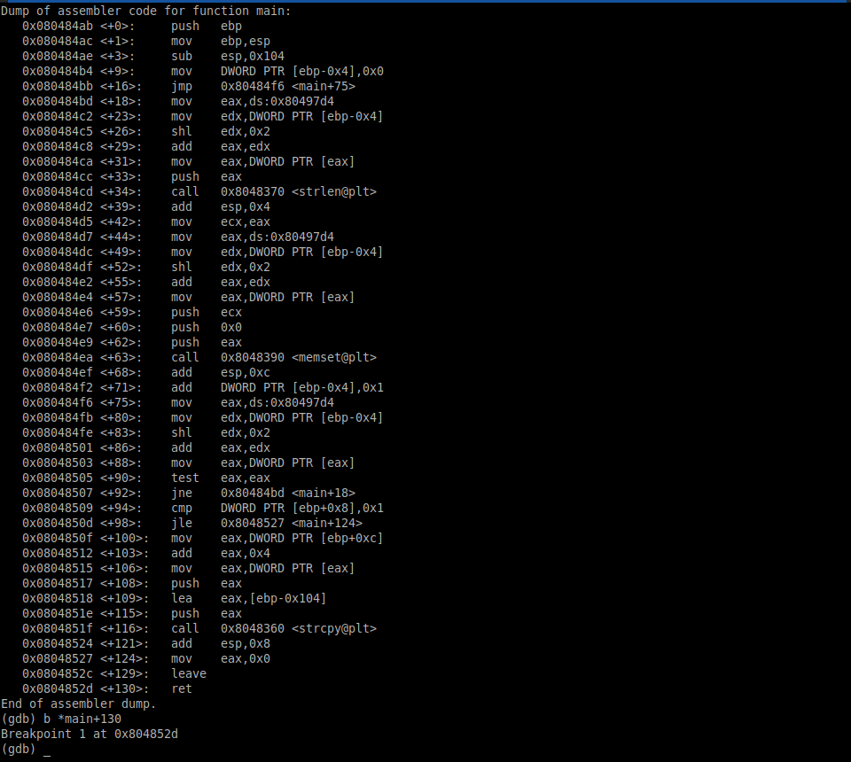
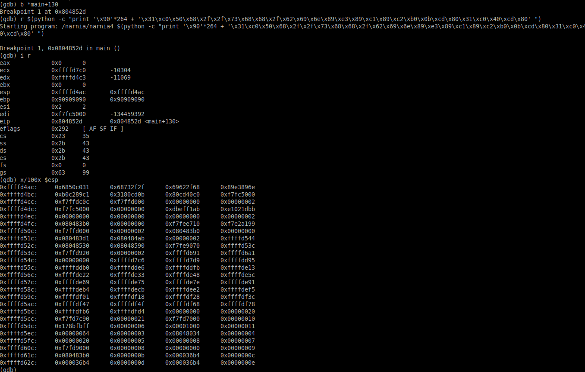
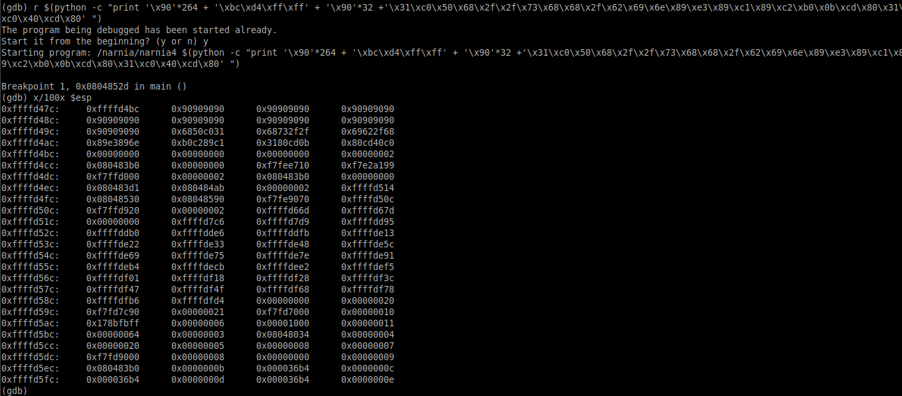
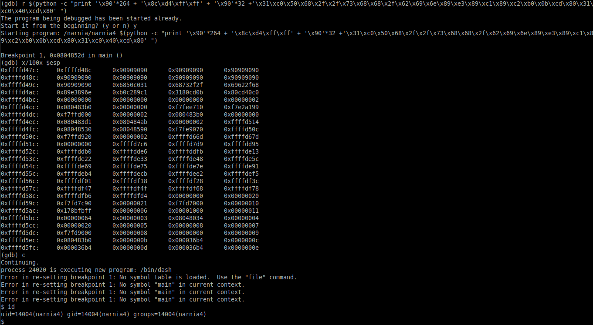
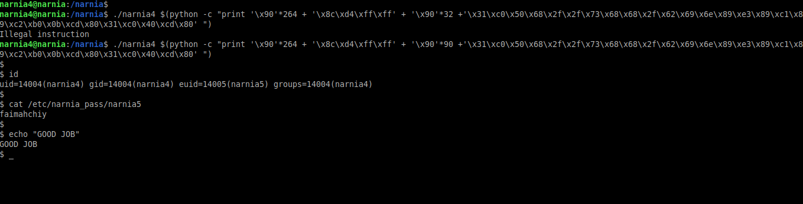

# Narnia: Level 4 Writeup

    ssh narnia4@narnia.labs.overthewire.org -p 2226
    password: thaenohtai

Level 2 'ye benzer bir soru...

264 karakterden sonra `EIP` registerı üzerine yazabiliyoruz.

Ana fonksiyonumuzun bittiği noktaya bir breakpoint koyalım

Stack içerisinde shellcode'un hangi adrese geldiğini bulalım ve `EIP` üzerine yazalım

Stack içerisinde gene ufak bir kayma oldu. `EIP` üzerine yazacağımız adresi güncelleyelim.

Ve shell geldi. Şimdi gdb'den çıkalım ve programımızı bu argüman ile çalıştıralım

`narnia5:faimahchiy`
