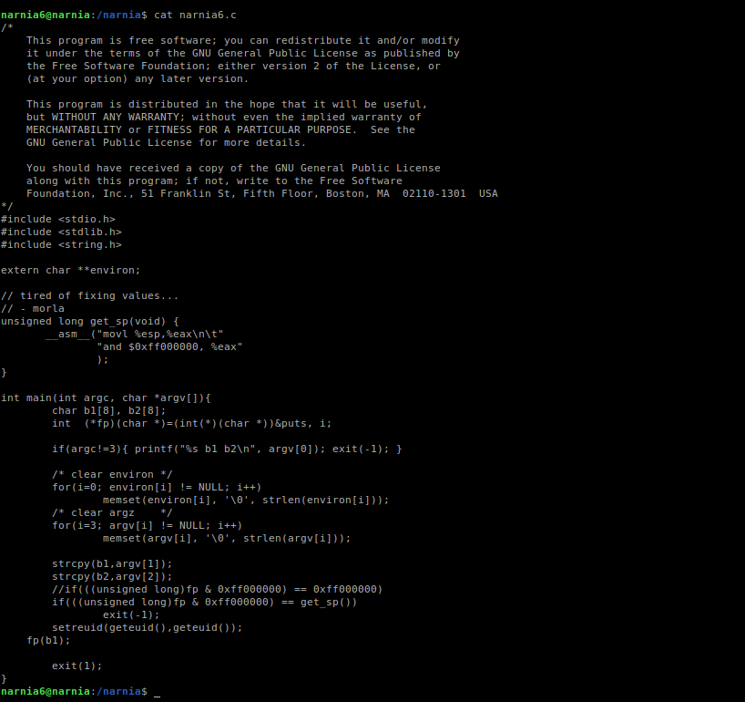
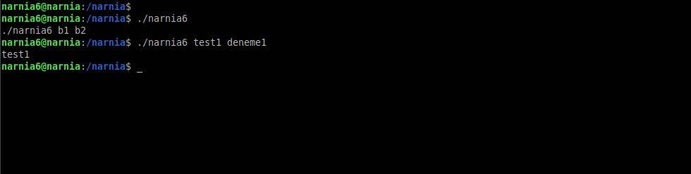
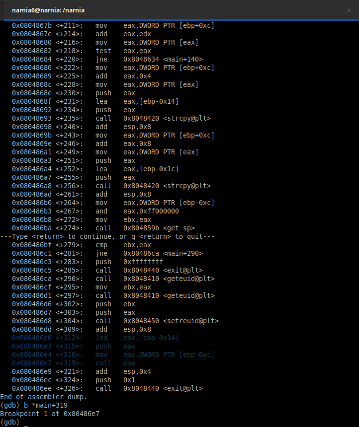
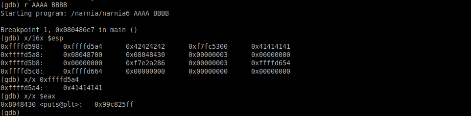
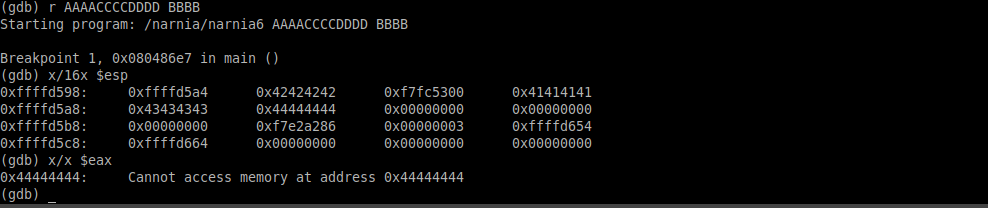
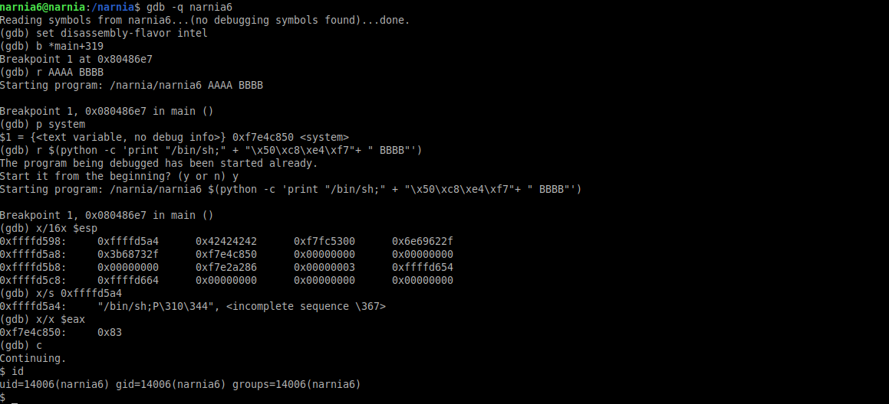
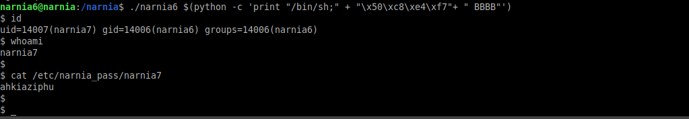

# Narnia: Level 6 Writeup

    ssh narnia6@narnia.labs.overthewire.org -p 2226
    password: neezocaeng

İki tane argüman alıyor ve bunları sırasıyla `b1` ve `b2` içerisine kopyalıyor. Ancak sadece ilk argümanı ekrana yazdırıyor. (`fp` değişkeni `puts()` fonksiyonunu işaret ediyor, `b1`'i göndererek sadece ilk argümanı yazdırmış oluyor)

Bu noktaya bir adet breakpoint koyalım ve stack içerisinde neler oluyormuş bir bakalım.

`lea` komutu ile `eax` içerisine bizim ilk argümanımızın olduğu adresi yüklüyoruz. Daha sonrada bu adresi stack içerisine gönderiyoruz. Böylece ilk argümanımızın adresini kaybetmemiş olacağız ki buda `puts` fonksiyonu çağrıldığında kullanılacak.

Daha sonra `eax` içerisine tekrardan birşeyler yükleniyor ve `call` fonksiyonu ile çağrılıyor. Demek ki bu bir fonksiyon. Yani yani bizim puts fonksiyonumuz

Çalıştırıp stack alanı içerisine baktığımız zaman herşey daha iyi oturacaktır sanırım. Stack de en başta bizim ilk argümanımızın adresi bulunmakta. Ayrıca `eax` registerına yüklenen `ebp-0xc` konumundaki adrese baktığımız zamanda `puts` işlemini görebiliyoruz.

O halde `ebp-0xc` konumundaki adres `eax`'a yüklenip call ediliyorsa bizde oraya istediğimiz bir adresi yazarak istediğimiz şeyi çalıştırmış olabiliriz.

`eax`'a istediğimiz şeyi yazabildik. O zaman son aşamaya geçebiliriz.

Hatırlayacağınız üzere girdiğimiz ilk argümanın adresini stack'e pushluyorduk ve mevcut durumda stack'in en üstünde bu adres kalıyordu. O halde eğer ben ilk argüman olarak `/bin/sh;` stringini verirsem (8 karakter yapıyor :D ) daha sonrada `system` func adresini girersem (ki o da tam olarak `eax` değerinin alındığı yere denk geliyor) herhangi bir shellcode yazmadan kolay bir şekilde shell alabilirim. Tabi programın çalışması için rastgele bir ikinci argüman girmemiz lazım

Evet gdb üzerinde çalıştırdık. Sırada programımızı normal çalışma akışında manipüle etmeye geldi.

    ./narnia6 $(python -c 'print "/bin/sh;" + "\x50\xc8\xe4\xf7"+ " BBBB"')

`narnia7:ahkiaziphu`
