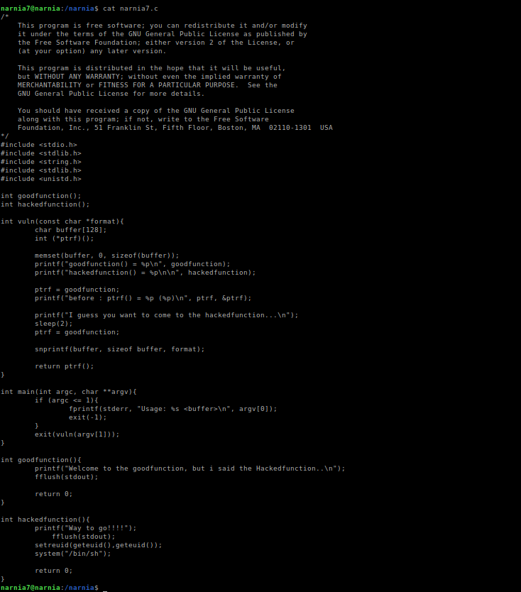
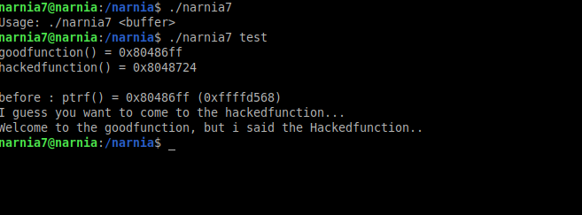
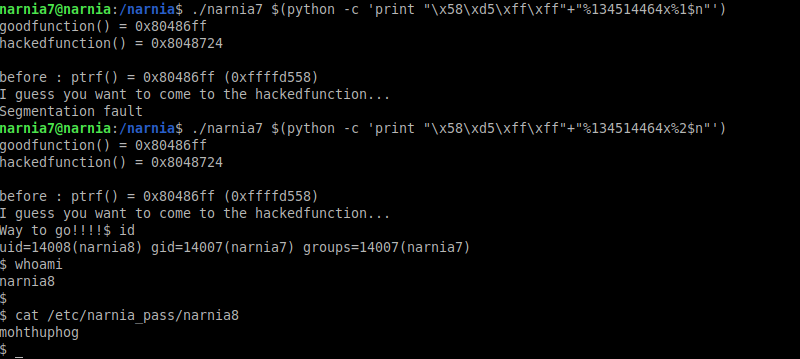

# Narnia: Level 7 Writeup

    ssh narnia7@narnia.labs.overthewire.org -p 2226
    password: ahkiaziphu




4 tane fonksiyonumuz mevcut. `main` fonksiyonumuz argüman sayısını kontrol ettikten sonra bizi `vuln` isimli fonksiyona yönlendiriyor. Bu fonksiyonumuz ise `goodfunction` adresini alarak bizi oraya yönlendiriyor. Ancak o fonksiyonun  içerisinde işimize yarayacak bişi yok. Eğer `hackedfunction` isimli fonksiyonu çalıştırabilirsek direk shell alabiliyoruz.

Bunun içinde dikkatimizi çeken `format string` zafiyetini kullanacağız.



Girmiş olduğumuz argümanı herhangi bir çıktı olarak bize vermiyor. Haliyle biraz bodoslama şekilde ilerlememiz gerekecek. (bize çıktı vermediği için format string zafiyetini kullanarak stack içerisindeki adresleri yazdıramıyoruz)

Ama genede bize ipucu vermiş. Çalıştırmak istediğimiz `hackedfunction` isimli fonksiyonun adresinin ne olduğunu, `goodfunction` isimli fonksiyonun adresinin ne olduğunu ve bunu tutan pointer adresinin ne olduğunu gösteriyor. O halde ben bu pointer adresinin olduğu yeri bulsam ve bunun içerisine `hackedfunction` adresini yazsam nasıl olur. Bence güzel olur :joy:

```bash
>>> 0x8048724
134514468
>>> 0x8048724 - 0x4
134514464
```

`hackedfunction` adresinin decimal karşılığını öğrendikten sonra öncesine 4 byte'lık bir adres yazacağımız için 4 çıkartıp not ediyoruz. Böylece `4 byte'lık adres + 134514464 = 134514468 (0x8048724)` olmuş olacak

Daha sonra girdiğimiz argümanın tam olarak kaçıncı sıraya yerleştiğini bilmediğimizden sırasıyla `%1$n`, `%2$n` ... şeklinde deneyeceğiz.



Neyseki çok uğraştırmadı ve 2. sırada denk geldi :)

`narnia8:mohthuphog`
