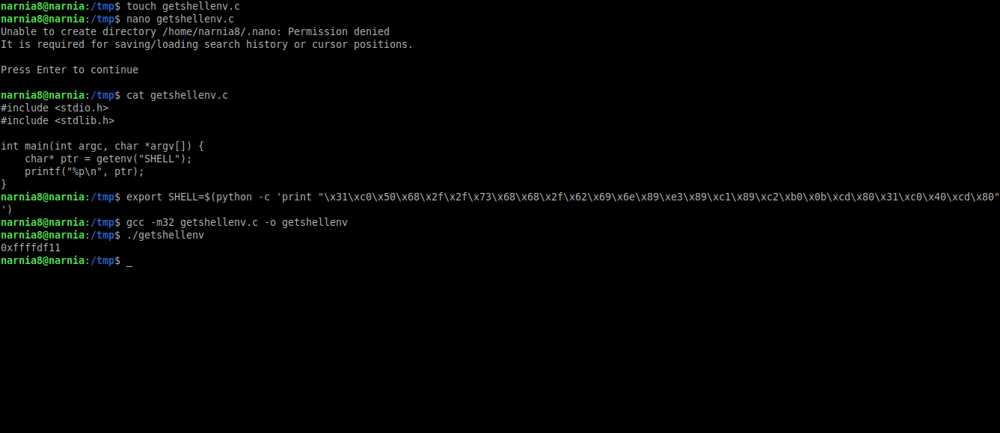

# Narnia: Level 8 Writeup

    ssh narnia8@narnia.labs.overthewire.org -p 2226
    password: mohthuphog


Bu soruda da `main` fonksiyonumuzun pek bir işlevi yok o yüzden `func` isimli fonksiyonumuzun içerisindeki `printf`'in olduğu kısıma bir breakpoint koyalım.


Şimdi buffer alanımız 20 karakter olduğu için önce 20 byte gönderelim stack durumuna bakalım ve 24 byte gönderip tekrar bakalım


Dikkatimizi çeken iki şey var. ilk 20 byte gönderdiğimizde stack içerisinde iki tane `0xffffd7b1` olduğunu görüyoruz. Bir de 24 byte gönderdiğimiz zaman sadece 1 byte'ı değiştirebiliyoruz.

Bu adrese eğer bakacak olursak içerisinde bizim girmiş olduğumuz input değerini tuttuğunu görebilirsiniz. Evet herneyse 20 byte'dan sonra yazdığımız her byte için bu adresin değeride 1 azalıyor. Yani 20 byte gönderdiğimiz zaman 0xffffd7b1 olan adres 20 byte + 8 byte 'lık birşey girdiğimiz zaman `0xffffd7b1 - 0x8 = 0xffffd7a9` olacaktır.

Bu neden bize lazım. Çünki devam edip `ebp` ve `eip` değerlerini değiştirmek için önce buranın aynı kalması lazım. Yani buraya, 28 byte lık değer geldiği zaman sahip olacağı adresi yazmamız lazım.


Gördüğünüz üzere adresi doğru tahmin ettik ve `ebp` üzerine yazabildik. Eğer dikkat ederseniz `ebp`'den bir önceki adres ile iki sonraki adres aynı değerlere sahip.

Şimdi `EIP` üzerine yazalım


Ve başarılı bir şekilde `EIP` adresinide değiştirebildik. Şimdi sisteme `local env` olarak bir shellcode ekleyelim ve adresini öğrenelim. Bu adreside `EIP` üzerine yazarak shellcode'umuzu çalıştıralım



```C
#include <stdio.h>
#include <stdlib.h>

int main(int argc, char *argv[]) {
    char* ptr = getenv("SHELLCODE");
    printf("%p\n", ptr);
}
```

[SHELLCODE](https://www.exploit-db.com/papers/13030)'a burdan ulaşabilirsiniz...

```bash
export SHELLCODE=$(printf "\x31\xc0\x31\xdb\x31\xc9\x99\xb0\xa4\xcd\x80\x6a\x0b\x58\x51\x68\x2f\x2f\x73\x68\x68\x2f\x62\x69\x6e\x89\xe3\x51\x89\xe2\x53\x89\xe1\xcd\x80")
```

Şimdi stack içerisinde tahmin etmemiz gereken o adresin ne olduğunu bulalım. Daha sonra 12 byte çıkaralım ve payloadımıza ekleyelim. Daha sonra `ebp`'ye yazmak üzere önemsiz bir 4 byte ve ardından `EIP` üzerine yazmak için shellcode adresini ekledik mi payloadımız hazır olacaktır.


Ve bu seviyeyide başarıyla tamamlayarak `NARNIA` macerasınıda tamamlamış olduk :)

`narnia9:eiL5fealae`
